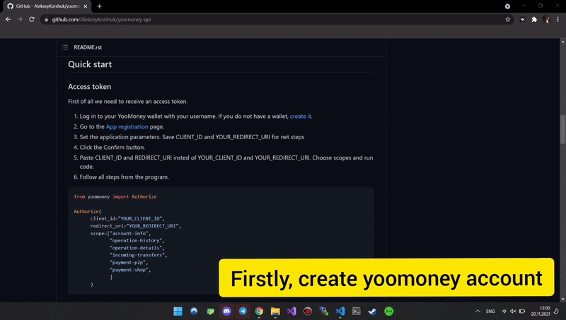

YooMoney API
============

*Unofficial Python library for the YooMoney API*

|pypi| |python| |license|

.. |pypi| image:: https://img.shields.io/pypi/v/yoomoney?color=blue&label=PyPI
   :target: https://pypi.org/project/yoomoney/
.. |python| image:: https://img.shields.io/pypi/pyversions/yoomoney
   :target: https://pypi.org/project/yoomoney/
.. |license| image:: https://img.shields.io/github/license/AlekseyKorshuk/yoomoney-api
   :target: https://github.com/AlekseyKorshuk/yoomoney-api/blob/master/LICENSE

`🇷🇺 Версия на русском языке <README_RU.rst>`_

----

.. contents:: Table of Contents
   :depth: 2
   :local:
   :backlinks: none

Introduction
============

This library provides a convenient Python wrapper around the
`YooMoney Wallet API <https://yoomoney.ru/docs/wallet>`__.
Both **synchronous** (``Client``) and **asynchronous** (``AsyncClient``) clients
are included out of the box.

Features
========

+-----------------------------+---------------------------------------------------------------+
| Method                      | Description                                                   |
+=============================+===============================================================+
| `Access token`_             | Obtain an OAuth access token.                                 |
+-----------------------------+---------------------------------------------------------------+
| `Account information`_      | Retrieve the current status of the user account.             |
+-----------------------------+---------------------------------------------------------------+
| `Operation history`_        | View the full or partial history of operations (paginated,    |
|                             | reverse-chronological order).                                 |
+-----------------------------+---------------------------------------------------------------+
| `Operation details`_        | Get detailed information about a single operation.            |
+-----------------------------+---------------------------------------------------------------+
| `Quickpay forms`_           | Generate a payment form for any website or bot.              |
+-----------------------------+---------------------------------------------------------------+
| `Payment checker`_          | Poll for incoming payments by label (sync & async).           |
+-----------------------------+---------------------------------------------------------------+
| `Webhook notifications`_    | Receive payment notifications via FastAPI.                    |
+-----------------------------+---------------------------------------------------------------+

Installation
============

**From PyPI** (recommended):

.. code-block:: shell

   pip install yoomoney --upgrade

Or with `uv <https://docs.astral.sh/uv/>`_:

.. code-block:: shell

   uv add yoomoney

**With webhook support:**

.. code-block:: shell

   pip install yoomoney fastapi

**From source**:

.. code-block:: shell

   git clone https://github.com/AlekseyKorshuk/yoomoney-api --recursive
   cd yoomoney-api
   uv sync

Quick start
===========

Access token
------------

First of all you need to receive an access token.

1. Log in to your YooMoney wallet. If you do not have one,
   `create it <https://yoomoney.ru/reg>`_.
2. Go to the `App registration <https://yoomoney.ru/myservices/new>`_ page.
3. Set the application parameters. Save **CLIENT_ID** and **REDIRECT_URI**.
4. Click **Confirm**.
5. Replace the placeholders below with your real credentials and run the code.
6. Follow the on-screen instructions.

.. code-block:: python

   from yoomoney import Authorize

   Authorize(
       client_id="YOUR_CLIENT_ID",
       redirect_uri="YOUR_REDIRECT_URI",
       client_secret="YOUR_CLIENT_SECRET",
       scope=[
           "account-info",
           "operation-history",
           "operation-details",
           "incoming-transfers",
           "payment-p2p",
           "payment-shop",
       ],
   )

Account information
-------------------

.. code-block:: python

   from yoomoney import Client

   client = Client("YOUR_TOKEN")
   user = client.account_info()

   print("Account number:", user.account)
   print("Balance:", user.balance, user.currency)
   print("Status:", user.account_status)
   print("Type:", user.account_type)

Operation history
-----------------

.. code-block:: python

   from yoomoney import Client

   client = Client("YOUR_TOKEN")
   history = client.operation_history(records=10)

   for op in history.operations:
       print(f"{op.datetime}  {op.direction:>4}  {op.amount} ₽  {op.label or '—'}")

Operation details
-----------------

.. code-block:: python

   from yoomoney import Client

   client = Client("YOUR_TOKEN")
   details = client.operation_details(operation_id="OPERATION_ID")

   for key, value in vars(details).items():
       if not key.startswith("_"):
           print(f"{key:20s} : {str(value).replace(chr(10), ' ')}")

Quickpay forms
--------------

.. code-block:: python

   from yoomoney import Quickpay

   quickpay = Quickpay(
       receiver="410019014512803",
       quickpay_form="shop",
       targets="Sponsor this project",
       paymentType="SB",
       sum=150,
   )
   print(quickpay.base_url)

Payment checker
---------------

``PaymentChecker`` polls the operation history and fires a callback as soon as
an incoming payment with the expected label (and optionally amount) arrives.

.. code-block:: python

   from yoomoney import Quickpay, PaymentChecker
   from yoomoney.operation.operation import Operation

   TOKEN    = "YOUR_TOKEN"
   RECEIVER = "YOUR_WALLET"

   label = PaymentChecker.make_label("order")

   quickpay = Quickpay(
       receiver=RECEIVER,
       quickpay_form="shop",
       targets="Order payment",
       paymentType="AC",
       sum=299.0,
       label=label,
   )
   print("Payment URL:", quickpay.base_url)

   def on_paid(op: Operation) -> None:
       print(f" Received {op.amount} ₽  label={op.label}")

   checker = PaymentChecker(token=TOKEN, interval=5)
   paid = checker.watch(label=label, callback=on_paid, amount=299.0, timeout=600)

Async version:

.. code-block:: python

   import asyncio
   from yoomoney import PaymentChecker
   from yoomoney.operation.operation import Operation

   async def main() -> None:
       checker = PaymentChecker(token="YOUR_TOKEN", interval=5)

       async def on_paid(op: Operation) -> None:
           print(f"  Received {op.amount} ₽")

       await checker.watch_async(label="order_123", callback=on_paid, timeout=300)

   asyncio.run(main())

Webhook notifications
---------------------

YooMoney can POST a notification to your server whenever a payment arrives.
This library provides a ready-to-use FastAPI handler with built-in SHA-1
signature verification.

**Step 1 — Install dependencies**

.. code-block:: shell

   pip install yoomoney fastapi

**Step 2 — Get your notification secret**

1. Go to `yoomoney.ru/transfer/myservices/http-notification <https://yoomoney.ru/transfer/myservices/http-notification>`_.
2. Copy the value from **«Секрет для проверки подлинности»** — this is your ``SECRET``.
3. Enter your server URL in **«Куда отправлять (URL сайта)»**.
4. Check **«Отправлять HTTP-уведомления»** and save.

**Step 3 — Create the server**

.. code-block:: python

   import os
   from fastapi import FastAPI, Request
   from yoomoney.webhook import Notification, fastapi_webhook

   SECRET = os.environ.get("YOOMONEY_SECRET", "YOUR_NOTIFICATION_SECRET")

   app = FastAPI()

   def on_payment(notification: Notification) -> None:
       print(f" Payment received!")
       print(f"  amount       : {notification.amount} ₽")
       print(f"  operation_id : {notification.operation_id}")
       print(f"  label        : {notification.label}")
       print(f"  sender       : {notification.sender}")

   @app.post("/yoomoney/notify")
   async def notify(request: Request):
       return await fastapi_webhook(
           request=request,
           secret=SECRET,
           on_payment=on_payment,
       )

**Step 4 — Run the server**

.. code-block:: shell

   uvicorn myapp:app --host 0.0.0.0 --port 8000

For production with multiple workers:

.. code-block:: shell

   uvicorn myapp:app --host 0.0.0.0 --port 8000 --workers 4

**Testing locally with ngrok**

YooMoney requires a public HTTPS URL to send notifications.
During local development you can get one for free using
`ngrok <https://ngrok.com>`_.

1. Sign up at `ngrok.com <https://ngrok.com>`_ and download the utility.

2. Authenticate (one-time setup):

.. code-block:: shell

   ngrok config add-authtoken YOUR_NGROK_TOKEN

3. In the first terminal, start your server:

.. code-block:: shell

   uvicorn myapp:app --host 0.0.0.0 --port 8000

4. In a second terminal, start ngrok:

.. code-block:: shell

   ngrok http 8000

5. Find the ``Forwarding`` line in ngrok output — this is your public URL:

.. code-block:: text

   Forwarding  https://abc123.ngrok-free.app -> http://localhost:8000

6. Copy that URL and paste it into the YooMoney notification settings,
   appending the path: ``https://abc123.ngrok-free.app/yoomoney/notify``

7. Click **«Протестировать»** — you should see the notification in your terminal:

.. code-block:: text

     Payment received!
     amount       : 200.39 ₽
     operation_id : test-notification
     label        :
     sender       : 41001000040

Pass ``verify=False`` to skip signature checking during local development:

.. code-block:: python

   return await fastapi_webhook(request=request, secret=SECRET,
                                on_payment=on_payment, verify=False)

Async client
============

.. code-block:: python

   import asyncio
   from yoomoney import AsyncClient

   async def main():
       async with AsyncClient("YOUR_TOKEN") as client:
           user    = await client.account_info()
           history = await client.operation_history(records=5)

           print("Balance:", user.balance)
           for op in history.operations:
               print(f"  {op.datetime}  {op.amount} ₽")

   asyncio.run(main())

----

License
=======

This project is licensed under the
`GPL-3.0 <https://github.com/AlekseyKorshuk/yoomoney-api/blob/master/LICENSE>`_.
